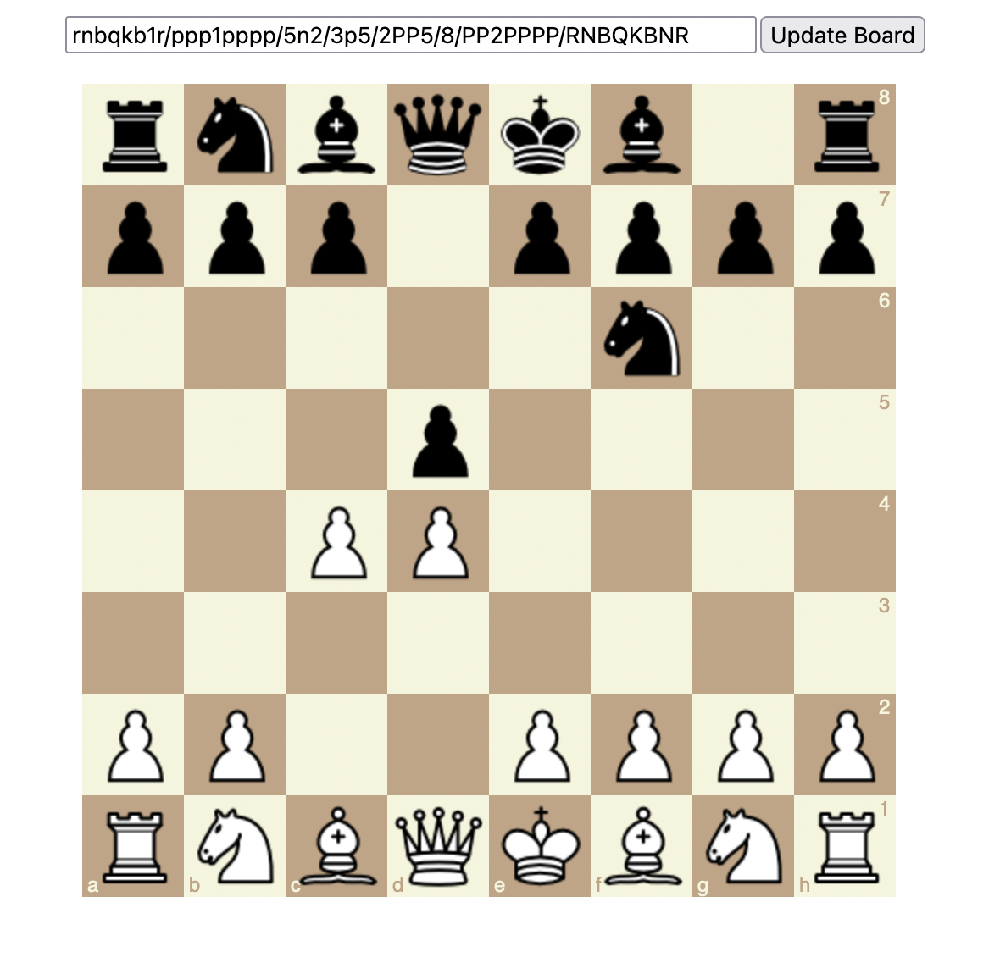

# Chess Board with FEN Input

This project is a simple chess board visualizer built using p5.js. It allows users to input a chess position using FEN (Forsyth-Edwards Notation) and displays the corresponding board layout.

## Features

- Displays a chess board with alternating light and dark squares
- Loads and displays chess piece images
- Accepts FEN input to set up custom board positions

## Running the Project on p5js.org

To run this project on p5js.org, follow these steps:

1. Go to [p5js.org](https://editor.p5js.org/)
2. Create a new sketch
3. Replace the contents of the `sketch.js` file in the p5.js Web Editor with the contents of the `sketch.js` file from this project
4. In the p5.js Web Editor, upload the files for each of the chess piece images (e.g., `white_pawn.png`, `dark_knight.png`, etc.) from this project
5. Click the "Run" button in the p5.js Web Editor to start the sketch

## Usage

Once the sketch is running:

1. You'll see a chess board with the initial starting position
2. There's an input field at the top of the canvas where you can enter a FEN string
3. After entering a valid FEN string, click the "Update Board" button to display the new position

## Screenshot

